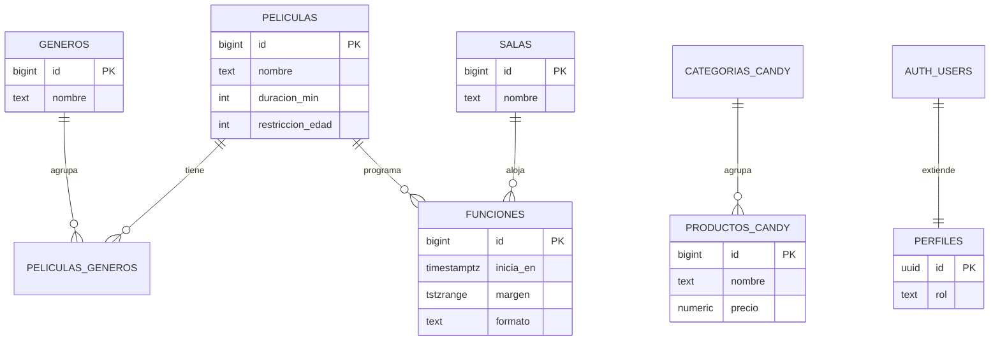

# Cine SAVA

Aplicación web completa para un cine: cartelera, candy bar, funciones con asignación
automática de sala, y compra de entradas con QR. Trabajo práctico de **Programación
IV** (UTN), cátedra Morelli.

**Demo:** https://cinesava.web.app
**Autor:** Santiago Vallina

---

## Índice

- [La consigna](#la-consigna)
- [Stack tecnológico](#stack-tecnológico)
- [Arquitectura](#arquitectura)
- [Modelo de datos](#modelo-de-datos)
- [Decisiones técnicas y por qué](#decisiones-técnicas-y-por-qué)
- [Roles y seguridad](#roles-y-seguridad)
- [Estado actual y roadmap](#estado-actual-y-roadmap)
- [Cómo correr el proyecto](#cómo-correr-el-proyecto)
- [Deploy](#deploy)

---

## La consigna

Un cine de un solo edificio, con varias salas de igual distribución de butacas,
necesita un sistema completo: cartelera pública, candy bar, funciones con asignación
automática de sala (sin superposiciones), compra de entradas con PDF y QR, panel de
administración y validación de entradas por parte de empleados.

El detalle completo de requerimientos, trazado email por email del enunciado, con las
reglas de negocio y el mapeo a temas de Angular vistos en clase, está en
[`docs/REQUERIMIENTOS.md`](docs/REQUERIMIENTOS.md).

### Requerimientos funcionales generales

Además de lo descrito en el documento de requerimientos, el sistema tiene que cumplir con
lo siguiente:

| # | Requerimiento |
|---|---------------|
| RF-1 | Estilo visual único y producido. |
| RF-2 | Interfaces fáciles de navegar para clientes y empleados. |
| RF-3 | Buen selector de fecha y hora (sin scroll infinito). |
| RF-4 | Aplicación desplegada con URL funcional. |
| RF-5 | Código en GitHub + README con arquitectura y decisiones técnicas. |
| RF-6 | Uso correcto de Angular, buenas prácticas y técnicas vistas en clase. |
| RF-7 | Integración con Supabase. |
| RF-8 | Integración de PWA. |
| RF-9 | Lógica de negocio lograda. |
| RF-10 | Defensa oral: explicar cada decisión y cada parte del código. |

---

## Stack tecnológico

| Capa | Tecnología |
|---|---|
| Frontend | Angular 22 (standalone components, Signals, Signal Forms) |
| Backend | Supabase (Postgres, Auth, Storage, RLS, funciones SQL) |
| Hosting | Firebase Hosting |
| Estilos | CSS |

No hay backend propio: toda la lógica que necesita ejecutarse en un lugar confiable
(asignación de salas, seguridad de datos) vive **dentro de Supabase**, como funciones
SQL y políticas de Row Level Security — no en un servidor que tuviéramos que escribir
y mantener nosotros.

---

## Arquitectura

```
componentes/   → pantallas (Cartelera, Login, Admin, DetallePelicula...)
servicios/     → única capa que habla con Supabase (Auth, Peliculas, Candy, Funciones...)
guards/        → protegen rutas según el rol del usuario
modelos/       → interfaces de TypeScript, calcadas de las tablas
```

**Regla de diseño que se repite en todo el proyecto:** un componente nunca llama a
Supabase directamente. Siempre le pide algo a un servicio. Si mañana cambia cómo se
pide un dato, se arregla en un único lugar, y los componentes no se enteran.

### Flujo típico de una pantalla

```
Supabase (tabla)
   → servicio (hace el select/insert/)
   → componente (lo guarda en un signal)
   → HTML (lo dibuja con @for / @if, reactivo)
```

### Flujo de autenticación

```
Registro/Login → Supabase Auth → trigger crea el perfil (rol = 'cliente' siempre)
                                → onAuthStateChange avisa
                                → signals usuario/perfil/cargando se actualizan
                                → Navbar y Guards leen esos signals y reaccionan solos
```

---

## Modelo de datos

Esquema completo, comentado, en [`docs/esquema.sql`](docs/esquema.sql) — es el script
real que se ejecutó en Supabase, en orden.



---

## Decisiones técnicas y por qué

### Componentes standalone, sin NgModule (salvo el tema visto en clase)
Es el estilo por defecto de Angular 22 y el que usa el material de la cátedra.

### Signals en vez de solo Observables
El estado de la app (sesión, carritos, filtros) se representa con `signal`/`computed`.
Se usa RxJS puntualmente donde hace falta puentear con algo asincrónico que un signal
no resuelve solo (por ejemplo, `toObservable` + `firstValueFrom` en
`Auth.listo()`, para poder hacer `await` de un cambio de signal).

### Géneros con tabla intermedia, candy con FK simple
Películas↔géneros es **muchos a muchos** (necesita tabla intermedia
`peliculas_generos`). Producto↔categoría de candy es **uno a muchos** (alcanza con
una columna `categoria_id`). Se modeló cada relación según lo que realmente es, no
todo con el mismo patrón.

### El rol de usuario nunca lo define el cliente
`perfiles.rol` se asigna **siempre** `'cliente'` por un trigger en la base, nunca por
lo que mande el formulario de registro. Evita que alguien se registre como admin
manipulando el pedido HTTP.

### Dos capas de seguridad: Guards (Angular) + RLS (Supabase)
Los Guards (`rolGuard`) evitan que un usuario sin permiso **vea** una pantalla que no
le corresponde — es una capa de experiencia de usuario. Las políticas RLS en Supabase
son la protección real: aunque alguien lograra saltarse el Guard editando el código
del navegador, la base igual rechaza cualquier operación no permitida. El código del
frontend es público; la seguridad de fondo no puede depender solo de él.

### La asignación automática de sala vive en SQL, no en Angular
`crear_funcion(...)` recorre las salas y asigna la primera libre, **dentro** de
Supabase. Se decidió así por una condición de carrera real: si dos administradores
crean funciones al mismo tiempo para el mismo horario, y la lógica estuviera en
Angular (consultar "¿está libre?" y después insertar, en dos pasos separados por un
viaje de ida y vuelta a internet), los dos podrían recibir "sí" y terminar pisando la
misma sala. Haciéndolo en SQL, cada intento de `insert` es evaluado por la base **en
el mismo instante**, así que no hay ninguna ventana de tiempo donde dos inserciones
conflictivas puedan colarse juntas.

### La regla de "no solapar, con 30 min de margen" es una restricción de la base, no una validación de formulario
```sql
exclude using gist (sala_id with =, margen with &&)
```
Es la garantía más fuerte posible: Postgres **rechaza** directamente cualquier
`insert` que pise otro horario en la misma sala, sin importar quién ni cómo lo
intente. Una validación solo en Angular podría evitarse llamando a la API directo.

`margen` es una columna separada (no calculada dentro de la restricción) porque
Postgres exige que las expresiones usadas en un índice sean *immutable*, y sumarle
un intervalo a una fecha no lo es. Se calcula una única vez, al insertar, dentro de
`crear_funcion`.

El margen va **desde que empieza la función hasta 30 minutos después de que termina**.
El rango es cerrado a la izquierda y abierto a la derecha, por lo que la siguiente
función puede empezar justo cuando se cumplen los 30 minutos, pero no antes.

### No existe una tabla de "butacas"
Las 6 salas tienen siempre la misma distribución (20 filas, 3 columnas, fila
accesible, filas VIP). Guardar cada butaca de cada sala sería una tabla de miles de
filas idénticas. El mapa se calcula en el código a partir de reglas fijas; en la base
solo se guardan las butacas que tienen algo especial, en `butacas_estado`.

### `butacas_estado` y selección en tiempo real
Una butaca que **no** aparece en `butacas_estado` está libre; si aparece, está
`bloqueada` (alguien la está eligiendo, vence a los 10 minutos) o `vendida`. No se
guarda el estado "libre" porque obligaría a crear ~500 filas por cada función.

- La **clave primaria** `(funcion_id, fila, numero)` impide que dos personas tomen la
  misma butaca aunque hagan clic al mismo tiempo (igual que la exclusión de funciones).
- La tabla solo se modifica con funciones SQL (`bloquear_butaca`, `liberar_butaca`),
  que validan todo del lado del servidor (función vigente, máximo 8 butacas).
- Como la tabla es pública y viaja por Realtime, no guarda el id de sesión sino su
  **hash SHA-256**: cada navegador reconoce sus bloqueos, pero nadie puede liberar los
  de otro.
- **Supabase Realtime** (`postgres_changes`) avisa a todos los que miran el mapa
  cuando una butaca cambia. Sin eso habría que recargar para ver lo que eligen otros.
- Se puede elegir sin estar logueado (el requerimiento permite compra anónima), por
  eso la sesión de bloqueo es un id aleatorio por pestaña (`sessionStorage`).

### Ruta con parámetro vía `@Input()`, no `ActivatedRoute`
`provideRouter(routes, withComponentInputBinding())` permite que `/pelicula/:id`
entregue el `id` como un `@Input()` normal del componente, en vez de inyectar
`ActivatedRoute` y suscribirse a un Observable de parámetros. Es la forma moderna y
más simple, consistente con el `@Input()` que ya se usa entre componentes padre-hijo.

---

## Roles y seguridad

| Rol | Puede |
|---|---|
| Anónimo | Ver cartelera, candy, complejo, comprar sin registrarse |
| `cliente` | Todo lo anterior + su perfil, historial (a futuro) |
| `admin` | Todo + panel de administración (`/admin`): funciones, roles de usuarios y precios del candy |
| `empleado` | Validar entradas y entregar candy por código (`/empleado`) |

El rol se determina en `perfiles.rol`, protegido por RLS (nadie puede modificarlo
desde el cliente) y por Guards de Angular (`rolGuard`) que protegen `/admin` y
`/empleado` a nivel de ruta, esperando siempre a que la sesión esté confirmada antes
de decidir (`Auth.listo()`), para no rechazar por error a alguien que sí tiene
permiso mientras la sesión todavía se está restaurando.

---

## Estado actual y roadmap

### Hecho
- Catálogo de películas (con géneros, buscador, filtro) y candy bar.
- Autenticación completa: registro con los datos pedidos, login, roles, sesión
  reactiva, redirección según rol.
- Guards por rol para `/admin` y `/empleado`.
- Salas y funciones, con asignación automática de sala y regla de no solapamiento
  (con margen de 30 minutos) garantizada en la base de datos.
- Pantalla de detalle de película con selector de fecha y horarios disponibles.
- Mapa de butacas (filas A-T, fila accesible, VIP +50%) con la pantalla dibujada,
  selección y bloqueo en tiempo real entre usuarios (Supabase Realtime).
- Carrito de candy y checkout con pago simulado, compra anónima o registrada, email
  obligatorio y aviso de edad. Entrada con código y QR (`qrcode`) y PDF descargable (`jspdf`).
- Panel de empleado: validación de entradas y entrega de candy por código; cada código
  se puede usar una sola vez (lo garantiza la base de datos).
- Panel de admin (dashboard con rutas hijas): crear y editar funciones, alta y edición de
  películas (con géneros), asignar roles por email, editar los precios del candy y reportes
  (facturación diaria, películas y productos más vendidos, con exportación a Excel y PDF).
  Todas las acciones son funciones SQL que verifican que quien llama sea admin.
- Las 3 películas más vendidas del inicio se calculan con las entradas vendidas
  (función SQL `peliculas_mas_vendidas`).
- PWA con `@angular/pwa`: se puede instalar en el celular o la computadora (manifest con
  nombre, colores e íconos del cine) y un service worker guarda la aplicación para que abra
  sin conexión, además de las últimas películas y productos del candy vistos. Las compras,
  las butacas y el panel necesitan conexión (los datos en vivo no se guardan en caché).
  El service worker solo funciona en el build de producción, no con `ng serve`.
- Deploy en Firebase Hosting, código en GitHub.

### Trabajo futuro 
Reseñas y puntaje promedio, programa de puntos y recompensas, cupones configurables,
preventa y sección "Próximamente", crédito por cancelación, reportes con gráficos y
exportación, log de actividad, combos entrada+candy. Están diseñados a nivel de
modelo de datos (ver comentarios al final de `docs/esquema.sql`) pero no implementados,
por prioridad de tiempo.

---

## Cómo correr el proyecto

```bash
npm install
ng serve
```

Abrir `http://localhost:4200`. Necesita un proyecto de Supabase propio: completar
`src/environments/environment.ts` y `environment.development.ts` con `supabaseUrl` y
`supabasePublishableKey`, y correr `docs/esquema.sql` en el SQL Editor de Supabase.

### Test de producción (antes de cada deploy)

```bash
ng build
npx serve -s dist/cine/browser
```

## Deploy

```bash
ng build
firebase deploy --only hosting
```
